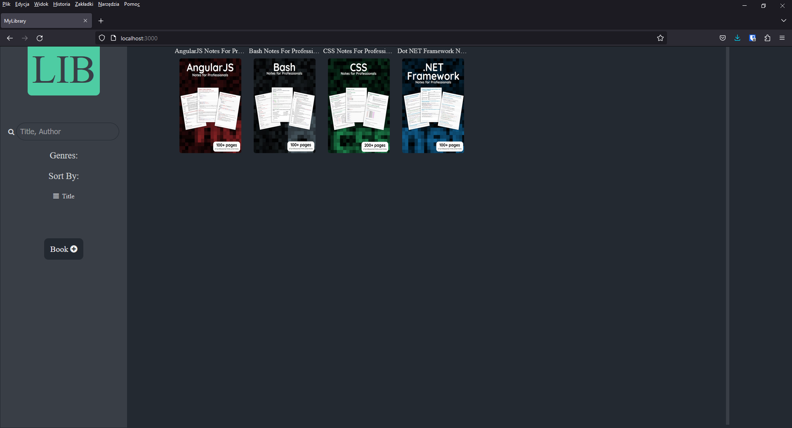
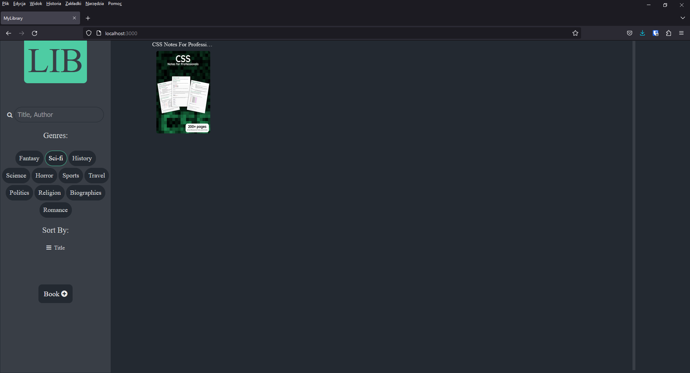
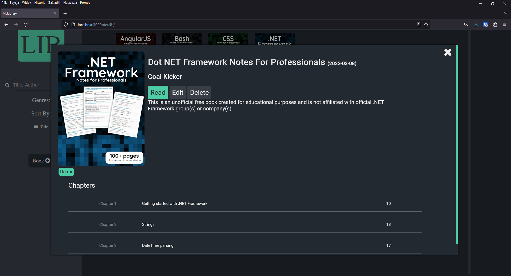
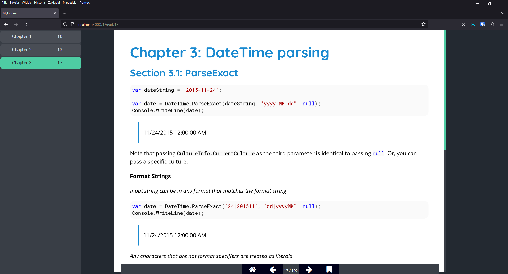
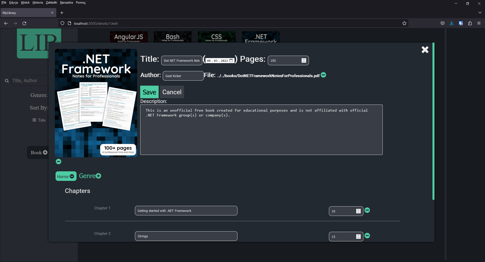
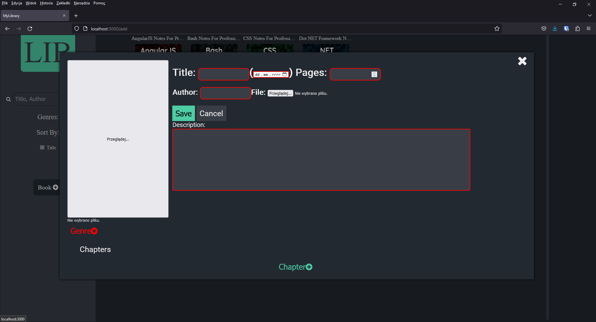

# Library
## Demo
https://tpsi-project.firebaseapp.com/

## Overview

The Books Library Web App is a web-based application that allows users to search, filter, sort, view, read, edit, and delete books. The app is built using Vue 3 with the options API and stores books as PDF files.

## Functionality

1. Search: Users can search books by title and author using the search bar
2. Filter: Users can filter books by genres using the genre dropdown menu.
3. Sort: Users can sort books by title, author, and date using the sort dropdown menu.
4. View: Users can click on a book to view its title, author, date, description, genres, list of chapters, and poster.
5. Read: Users can click on the "Read" button to read a book. They can also click on the "Bookmark" button to save their progress.
6. Edit: Users can click on the "Edit" button to edit a book.
7. Delete: Users can click on the "Delete" button to delete a book.
8. Add: Users can add new books to the system by filling out and submitting a form.

## Screenshots

### Home page

### Filtered by genres

### Details page

### Read page

### Edit book page

### Add book page

